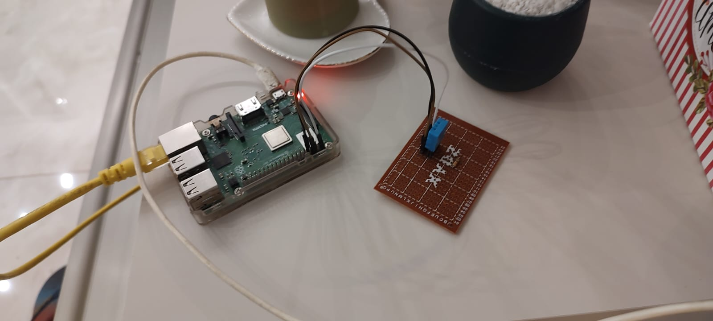
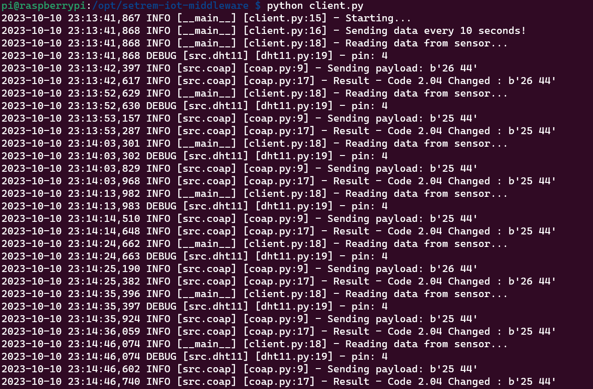

# setrem-iot-raspberry
Este repositório representa o código-fonte que executa no Raspberry PI.

É utilizada a biblioteca [Adafruit_DHT](https://github.com/adafruit/Adafruit_Python_DHT) para obter dados do sensor de temperatura e humidade [DHT11](https://www.mouser.com/datasheet/2/758/DHT11-Technical-Data-Sheet-Translated-Version-1143054.pdf). Após leitura do sensor, os dados são enviados via protocolo [coap](https://en.wikipedia.org/wiki/Constrained_Application_Protocol) para uma aplicação.

## Ambiente
- Estamos utilizando um Raspberry PI PB3 para executar este código.



- Foi necessário instalar os pacotes do arquivo [requirements.txt](./requirements.txt) no dispositivo.

## Preparando o meu ambiente para testes local
- Instalando o pyenv para Windows: https://github.com/pyenv-win/pyenv-win

- Instalando versão 3.11.0 do Python via pyenv:
```sh
pyenv install 3.11.0
```

- Configurando a versão 3.11.0 como a default:
```sh
pyenv global 3.11.0
```

## Testando na minha máquina
Gerenciamento dos pacotes os pacotes Python via [Poetry](https://python-poetry.org/).

```sh
poetry install
poetry shell
python app.py
```

## Executando no Raspberry

Este é um exemplo da execução, lendo os dados do sensor e enviando via Coap:

